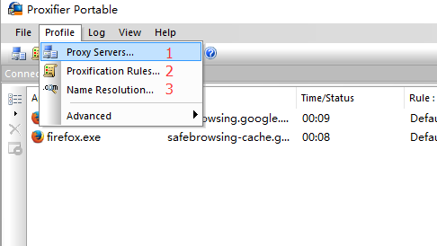
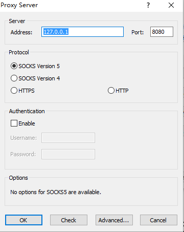
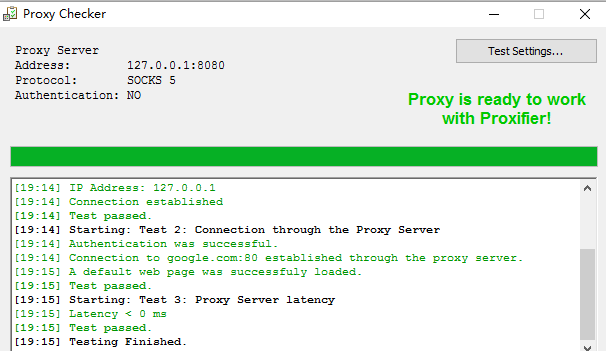
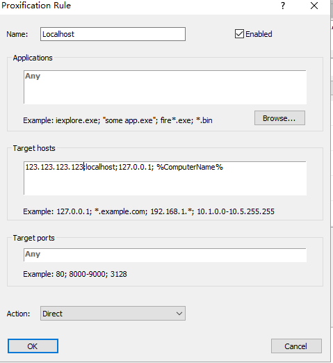
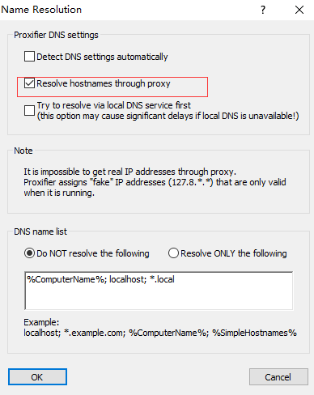

# proxifier

## proxifier 能干什么

proxifier 是一款全局代理 app, vps+shadowsocks 的方式只能适用于浏览器代理,但是对于一般应用程序来说无法实现代理, proxifier 可以解决这个问题.

## 如何配置 proxifier

如果你的 vps 搭载了 shadowsocks 那么配置 proxifier 就简单很多了 
三步走: 

- 代理服务器配置
- 代理规则设置
- 域名解析设置

### 代理服务器配置

输入 shadowsocks 的本地代理服务器地址和端口(ss 设置为全局代理模式,端口默认 1080),选择 socks5 协议

配置好后可以 test 网络有无联通

> 接下来的两步配置至关重要，配置错误可能导致全局代理失败或者循环代理

### 代理规则设置

Target hosts 处添加 shadowshocks 代理服务器的 IP 地址,action 选择直连

### 域名解析设置

选择 Resolve hostnames through proxy

### ok done

> 浏览器访问<a href="http://www.ip138.com">ip138</a>, 你的 ip 已经变成了国外
