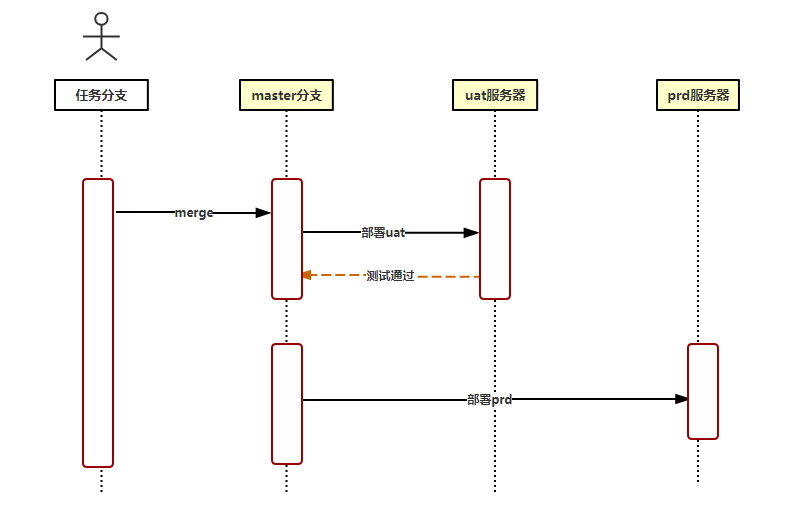
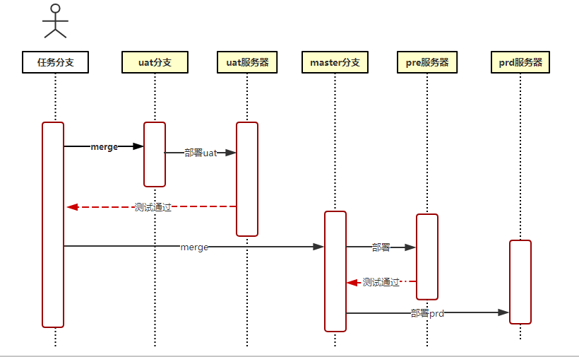

# 测试环境分类

## uat-prd模式

为了便于理解,我画了如下时序图来表示整个开发到上线的过程,uat-prd模式分为两个服务器,一个测试服务器uat,一个线上服务器prd,然后部署上这两个服务器的都是同一套master代码。

咋一看，整个流程很连贯，开发新建任务分支进行开发，完成后将代码部署上master分支，然后部署上uat服务器进行测试，master分支代码验证完后，就可以愉快的部署上prd服务器。但是这种模式只适合于项目初期阶段，需要频繁进行prd部署的情况

> 缺点：
> - 所有开发分支都合并到master分支，必定会导致master分支后期脏代码增加。
> - uat测试失败的任务留在master分支上，会导致整个上线任务被延误。

## uat-pre-prd模式

为了弥补uat-prd模式的缺点，我们增加了一个测试环境，pre。

增加了pre环境后，我们可以单独搞个uat分支出来了，这个uat分支专门拿来部署上uat服务器，master分支则部署上pre服务器进行测试，实现两个测试环境代码隔离，这样我们可以把初期uat测试失败的一些问题留在uat分支，避免脏代码上到master分支，保证master代码的纯净，同时也不会影响到上线任务。
