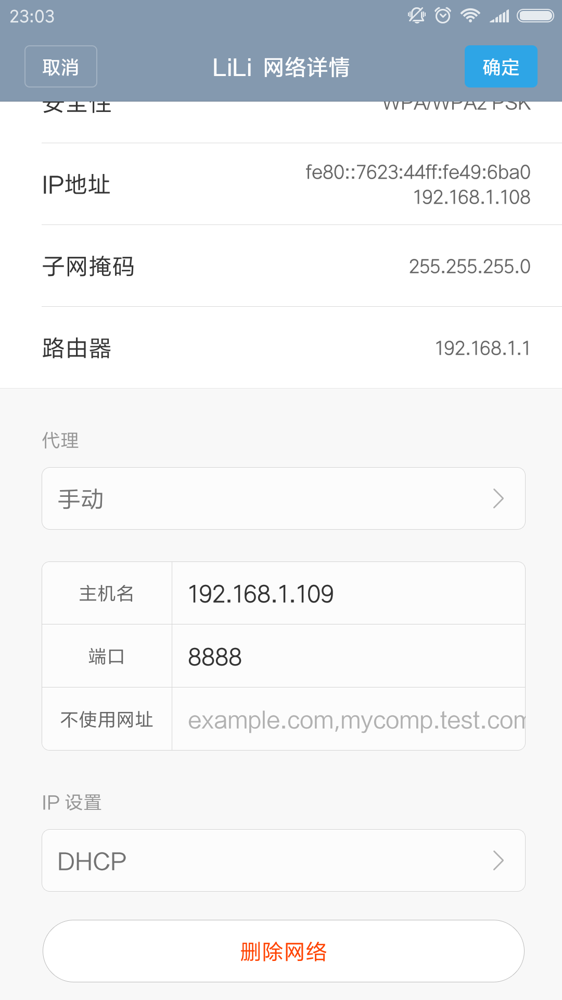

# fidder抓包https实现

## 抓包原理
fiddler实现抓包是以fiddler作为中间代理,任何网络请求都会经过代理服务器的解析。不过由于https加密的特殊性，需要对进行额外的配置，才能愉快的使用fiddler来抓取https协议请求。

## 步入正题
### 手机配置
要让fiddler抓到手机发出的网络请求，前提是手机和pc需是同一网段，设置手机的wifi代理为fiddler

