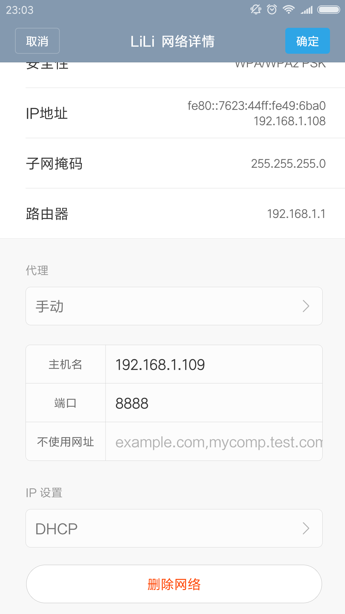
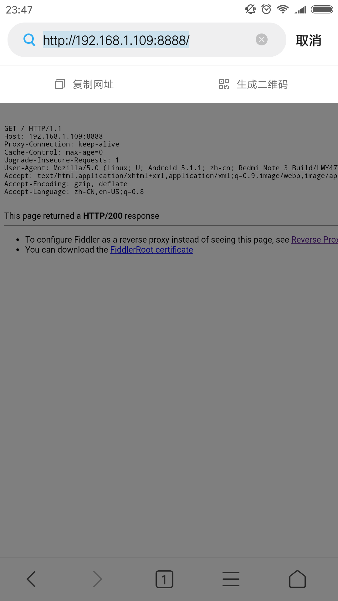
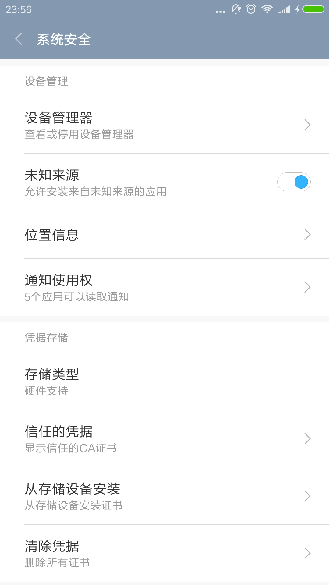
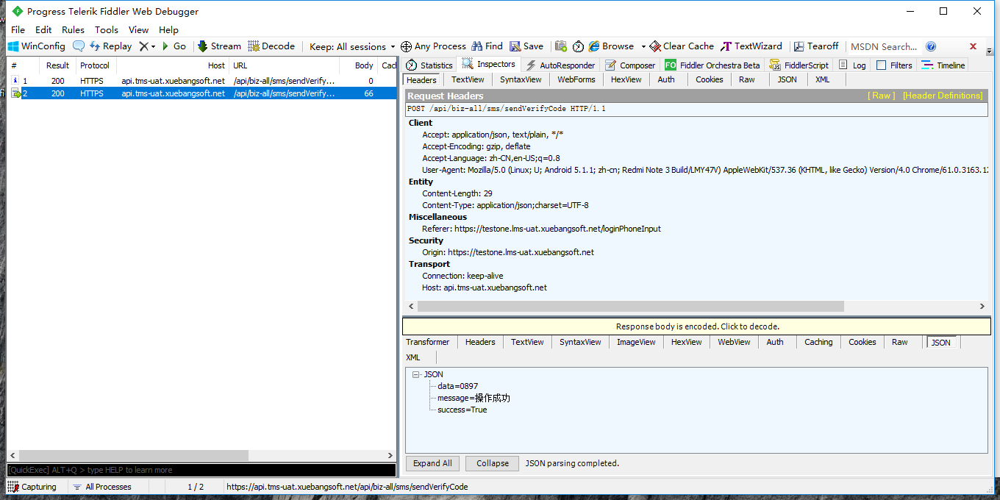

# fidder抓包https实现

## 抓包原理
fiddler实现抓包是以fiddler作为中间代理,任何网络请求都会经过代理服务器的解析。不过由于https加密的特殊性，需要对进行额外的配置，才能愉快的使用fiddler来抓取https协议请求。

##步入正题
###手机配置
要让fiddler抓到手机发出的网络请求，前提是手机和pc需是同一网段，设置手机的wifi代理为fiddler

### 下载fiddler证书
要利用fiddler抓取https，这是很关键的一步，你需要在手机上安装fiddler的证书，让手机信任fiddler。浏览器输入pc端fiddler的服务地址192.168.xxx.xxx:8888，fiddler默认端口为8888，下载即可。

### 安装fiddler证书
以android为例，系统安全-从存储设备安装证书，选择上一步下载号的证书安装即可。安装时会提示输入证书名称，随意。

### 愉快的抓包
