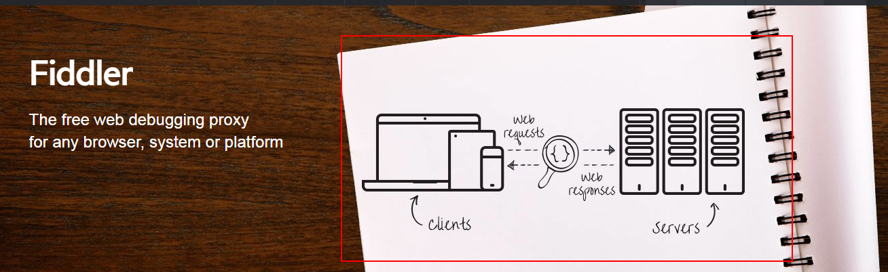
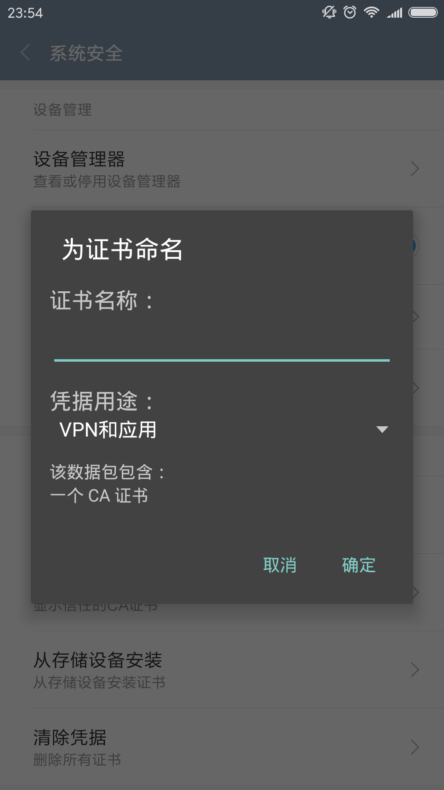

# fidder 手机抓包 https 实现

## 抓包原理

fiddler 实现抓包是以 fiddler 作为中间代理([正向代理](https://baike.baidu.com/item/%E6%AD%A3%E5%90%91%E4%BB%A3%E7%90%86/9524799)),任何网络请求都会经过代理服务器的解析。不过由于 https 加密的特殊性，需要对进行额外的配置，才能愉快的使用 fiddler 来抓取 https 协议请求。

## 步入正题

### 手机设置 wifi 代理

要让 fiddler 抓到手机发出的网络请求，前提是手机和 pc 需是同一网段，设置手机的 wifi 代理为 fiddler

### 下载 fiddler 证书

要利用 fiddler 抓取 https，这是很关键的一步，你需要在手机上安装 fiddler 的根证书，让手机信任 fiddler。浏览器输入 pc 端 fiddler 的服务地址 192.168.xxx.xxx:8888，fiddler 默认端口为 8888，下载即可。

### 安装 fiddler 证书

以 android 为例，系统安全-从存储设备安装证书，选择上一步下载号的证书安装即可。安装时会提示输入证书名称，随意。

### 愉快的抓包 https

> tips：pc 端抓包 https 原理相同，也需要安装 fiddler 根证书，但是步骤稍微简单点，只需要打开 fiddler 安装证书即可。
> 

### End
